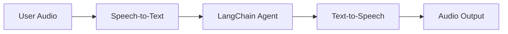
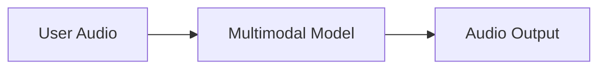

Some applications, including customer support, personal assistants, and hands-free interfaces, can benefit from supporting real-time interactions through audio.

This tutorial demonstrates how to interact with LangChain [agents](/oss/javascript/langchain/agents) through voice channels. It follows the reference architecture implemented in the [LangChain repo](https://github.com/langchain-ai/voice-sandwich-demo).

## Concepts

There are two common architectures for voice agents:

### 1. "The Sandwich"

The Sandwich architecture composes three distinct components: speech-to-text (STT), a text-based LangChain agent, and text-to-speech (TTS).



**Pros:**
- Full control over each component (swap STT/TTS providers as needed)
- Access to latest capabilities from modern text-modality models
- Transparent behavior with clear boundaries between components

**Cons:**
- Requires orchestrating multiple services
- Additional complexity in managing the pipeline
- Conversion from speech to text loses information (e.g., tone, emotion)

### 2. Speech-to-Speech Architecture

Speech-to-speech uses a multimodal model that processes audio input and generates audio output natively.



**Pros:**
- Simpler architecture with fewer moving parts
- Typically lower latency for simple interactions
- Direct audio processing captures tone and other nuances of speech

**Cons:**
- Limited model options, greater risk of provider lock-in
- Features may lag behind text-modality models
- Less transparency in how audio is processed
- Reduced controllability and customization options

## Demo application overview

This guide demonstrates the **sandwich architecture** to balance performance, controllability, and access to modern model capabilities. The sandwich can achieve sub-700ms latency with some STT and TTS providers while maintaining control over modular components.

The agent will manage orders for a sandwich shop. The application will demonstrate all three components of the sandwich architecture, using [AssemblyAI](https://www.assemblyai.com/) for STT and [ElevenLabs](https://elevenlabs.io/) for TTS (although adapters can be built for most providers).

An end-to-end reference application is available in the [voice-sandwich-demo](https://github.com/langchain-ai/voice-sandwich-demo) repository. We will walk through that application here.

The demo uses WebSockets for real-time bidirectional communication between the browser and server. The same architecture can be adapted for other transports like telephony systems (Twilio, Vonage) or WebRTC connections.

### Architecture

The demo implements a streaming pipeline where each stage processes data asynchronously:

**Client (Browser)**
- Captures microphone audio and encodes it as PCM
- Establishes WebSocket connection to the backend server
- Streams audio chunks to the server in real-time
- Receives and plays back synthesized speech audio


**Server (Node.js)**


- Accepts WebSocket connections from clients
- Orchestrates the three-step pipeline:
  - [Speech-to-text (STT)](#1-speech-to-text): Forwards audio to the STT provider (e.g., AssemblyAI), receives transcript events
  - [Agent](#2-langchain-agent): Processes transcripts with LangChain agent, streams response tokens
  - [Text-to-speech (TTS)](#3-text-to-speech): Sends agent responses to the TTS provider (e.g., ElevenLabs), receives audio chunks

- Returns synthesized audio to the client for playback


The pipeline uses async iterators to enable streaming at each stage. This allows downstream components to begin processing before upstream stages complete, minimizing end-to-end latency.


## Setup

For detailed installation instructions and setup, see the [repository README](https://github.com/langchain-ai/voice-sandwich-demo#readme).

## 1. Speech-to-text

The STT stage transforms an incoming audio stream into text transcripts. The implementation uses a producer-consumer pattern to handle audio streaming and transcript reception concurrently.

### Key Concepts

**Producer-Consumer Pattern**: Audio chunks are sent to the STT service concurrently with receiving transcript events. This allows transcription to begin before all audio has arrived.

**Event Types**:
- `stt_chunk`: Partial transcripts provided as the STT service processes audio
- `stt_output`: Final, formatted transcripts that trigger agent processing

**WebSocket Connection**: Maintains a persistent connection to AssemblyAI's real-time STT API, configured for 16kHz PCM audio with automatic turn formatting.

### Implementation


```typescript
import { AssemblyAISTT } from "./assemblyai";
import type { VoiceAgentEvent } from "./types";

async function* sttStream(
  audioStream: AsyncIterable<Uint8Array>
): AsyncGenerator<VoiceAgentEvent> {
  const stt = new AssemblyAISTT({ sampleRate: 16000 });
  const passthrough = writableIterator<VoiceAgentEvent>();

  // Producer: pump audio chunks to AssemblyAI
  const producer = (async () => {
    try {
      for await (const audioChunk of audioStream) {
        await stt.sendAudio(audioChunk);
      }
    } finally {
      await stt.close();
    }
  })();

  // Consumer: receive transcription events
  const consumer = (async () => {
    for await (const event of stt.receiveEvents()) {
      passthrough.push(event);
    }
  })();

  try {
    // Yield events as they arrive
    yield* passthrough;
  } finally {
    // Wait for producer and consumer to complete
    await Promise.all([producer, consumer]);
  }
}
```


The application implements an AssemblyAI client to manage the WebSocket connection and message parsing. See below for implementations; similar adapters can be constructed for other STT providers.

<Accordion title="AssemblyAI Client">


```typescript
export class AssemblyAISTT {
  protected _bufferIterator = writableIterator<VoiceAgentEvent.STTEvent>();
  protected _connectionPromise: Promise<WebSocket> | null = null;

  async sendAudio(buffer: Uint8Array): Promise<void> {
    const conn = await this._connection;
    conn.send(buffer);
  }

  async *receiveEvents(): AsyncGenerator<VoiceAgentEvent.STTEvent> {
    yield* this._bufferIterator;
  }

  protected get _connection(): Promise<WebSocket> {
    if (this._connectionPromise) return this._connectionPromise;

    this._connectionPromise = new Promise((resolve, reject) => {
      const params = new URLSearchParams({
        sample_rate: this.sampleRate.toString(),
        format_turns: "true",
      });
      const url = `wss://streaming.assemblyai.com/v3/ws?${params}`;
      const ws = new WebSocket(url, {
        headers: { Authorization: this.apiKey },
      });

      ws.on("open", () => resolve(ws));

      ws.on("message", (data) => {
        const message = JSON.parse(data.toString());
        if (message.type === "Turn") {
          if (message.turn_is_formatted) {
            this._bufferIterator.push({
              type: "stt_output",
              transcript: message.transcript,
              ts: Date.now()
            });
          } else {
            this._bufferIterator.push({
              type: "stt_chunk",
              transcript: message.transcript,
              ts: Date.now()
            });
          }
        }
      });
    });

    return this._connectionPromise;
  }
}
```


</Accordion>

## 2. LangChain agent

The agent stage processes text transcripts through a LangChain [agent](/oss/javascript/langchain/agents) and streams the response tokens. In this case, we stream all [text content blocks](/oss/javascript/langchain/messages#textcontentblock) generated by the agent.

### Key Concepts

**Streaming Responses**: The agent uses [`stream_mode="messages"`](/oss/javascript/langchain/streaming#llm-tokens) to emit response tokens as they're generated, rather than waiting for the complete response. This enables the TTS stage to begin synthesis immediately.

**Conversation Memory**: A [checkpointer](/oss/javascript/langchain/short-term-memory) maintains conversation state across turns using a unique thread ID. This allows the agent to reference previous exchanges in the conversation.

### Implementation


```typescript
import { createAgent } from "langchain";
import { HumanMessage } from "@langchain/core/messages";
import { MemorySaver } from "@langchain/langgraph";
import { tool } from "@langchain/core/tools";
import { z } from "zod";
import { v4 as uuidv4 } from "uuid";

// Define agent tools
const addToOrder = tool(
  async ({ item, quantity }) => {
    return `Added ${quantity} x ${item} to the order.`;
  },
  {
    name: "add_to_order",
    description: "Add an item to the customer's sandwich order.",
    schema: z.object({
      item: z.string(),
      quantity: z.number(),
    }),
  }
);

const confirmOrder = tool(
  async ({ orderSummary }) => {
    return `Order confirmed: ${orderSummary}. Sending to kitchen.`;
  },
  {
    name: "confirm_order",
    description: "Confirm the final order with the customer.",
    schema: z.object({
      orderSummary: z.string().describe("Summary of the order"),
    }),
  }
);

// Create agent with tools and memory
const agent = createAgent({
  model: "claude-haiku-4-5",
  tools: [addToOrder, confirmOrder],
  checkpointer: new MemorySaver(),
  systemPrompt: `You are a helpful sandwich shop assistant.
Your goal is to take the user's order. Be concise and friendly.
Do NOT use emojis, special characters, or markdown.
Your responses will be read by a text-to-speech engine.`,
});

async function* agentStream(
  eventStream: AsyncIterable<VoiceAgentEvent>
): AsyncGenerator<VoiceAgentEvent> {
  // Generate unique thread ID for conversation memory
  const threadId = uuidv4();

  for await (const event of eventStream) {
    // Pass through all upstream events
    yield event;

    // Process final transcripts through the agent
    if (event.type === "stt_output") {
      const stream = await agent.stream(
        { messages: [new HumanMessage(event.transcript)] },
        {
          configurable: { thread_id: threadId },
          streamMode: "messages",
        }
      );

      // Yield agent response chunks as they arrive
      for await (const [message] of stream) {
        yield { type: "agent_chunk", text: message.text, ts: Date.now() };
      }
    }
  }
}
```


## 3. Text-to-speech

The TTS stage synthesizes agent response text into audio and streams it back to the client. Like the STT stage, it uses a producer-consumer pattern to handle concurrent text sending and audio reception.

### Key Concepts

**Concurrent Processing**: The implementation merges two async streams:
- **Upstream processing**: Passes through all events and sends agent text chunks to the TTS provider
- **Audio reception**: Receives synthesized audio chunks from the TTS provider

**Streaming TTS**: Some providers (such as [ElevenLabs](https://elevenlabs.io/)) begin synthesizing audio as soon as it receives text, enabling audio playback to start before the agent finishes generating its complete response.

**Event Passthrough**: All upstream events flow through unchanged, allowing the client or other observers to track the full pipeline state.

### Implementation


```typescript
import { ElevenLabsTTS } from "./elevenlabs";

async function* ttsStream(
  eventStream: AsyncIterable<VoiceAgentEvent>
): AsyncGenerator<VoiceAgentEvent> {
  const tts = new ElevenLabsTTS();
  const passthrough = writableIterator<VoiceAgentEvent>();

  // Producer: read upstream events and send text to ElevenLabs
  const producer = (async () => {
    try {
      for await (const event of eventStream) {
        passthrough.push(event);
        if (event.type === "agent_chunk") {
          await tts.sendText(event.text);
        }
      }
    } finally {
      await tts.close();
    }
  })();

  // Consumer: receive audio from ElevenLabs
  const consumer = (async () => {
    for await (const event of tts.receiveEvents()) {
      passthrough.push(event);
    }
  })();

  try {
    // Yield events from both producer and consumer
    yield* passthrough;
  } finally {
    await Promise.all([producer, consumer]);
  }
}
```


The application implements an ElevenLabs client to manage the WebSocket connection and audio streaming. See below for implementations; similar adapters can be constructed for other TTS providers.

<Accordion title="ElevenLabs Client">


```typescript
export class ElevenLabsTTS {
  protected _bufferIterator = writableIterator<VoiceAgentEvent.TTSEvent>();
  protected _connectionPromise: Promise<WebSocket> | null = null;

  async sendText(text: string | null): Promise<void> {
    if (!text || !text.trim()) return;

    const conn = await this._connection;
    const payload = { text, try_trigger_generation: false };
    conn.send(JSON.stringify(payload));
  }

  async *receiveEvents(): AsyncGenerator<VoiceAgentEvent.TTSEvent> {
    yield* this._bufferIterator;
  }

  protected get _connection(): Promise<WebSocket> {
    if (this._connectionPromise) return this._connectionPromise;

    this._connectionPromise = new Promise((resolve, reject) => {
      const url = `wss://api.elevenlabs.io/v1/text-to-speech/${this.voiceId}/stream-input?model_id=${this.modelId}&output_format=${this.outputFormat}`;
      const ws = new WebSocket(url);

      ws.on("open", () => {
        // Send initial configuration
        const bosMessage = {
          text: " ",
          voice_settings: {
            stability: 0.5,
            similarity_boost: 0.75,
          },
          xi_api_key: this.apiKey,
        };
        ws.send(JSON.stringify(bosMessage));
        resolve(ws);
      });

      ws.on("message", (data) => {
        const message = JSON.parse(data.toString());

        // Decode and push audio chunks
        if (message.audio) {
          const audioChunk = Buffer.from(message.audio, "base64");
          if (audioChunk.length > 0) {
            this._bufferIterator.push({
              type: "tts_chunk",
              audio: new Uint8Array(audioChunk),
              ts: Date.now()
            });
          }
        }

        // Close iterator on final message
        if (message.isFinal) {
          this._bufferIterator.cancel();
        }
      });
    });

    return this._connectionPromise;
  }
}
```

</Accordion>


## Putting It All Together

The complete pipeline chains the three stages together:


```typescript
app.get("/ws", upgradeWebSocket(async () => {
  const inputStream = writableIterator<Uint8Array>();

  // Chain the three stages
  const transcriptEventStream = sttStream(inputStream);
  const agentEventStream = agentStream(transcriptEventStream);
  const outputEventStream = ttsStream(agentEventStream);

  // Process pipeline and send TTS audio to client
  const flushPromise = (async () => {
    for await (const event of outputEventStream) {
      if (event.type === "tts_chunk") {
        currentSocket?.send(event.audio);
      }
    }
  })();

  return {
    onMessage(event) {
      // Push incoming audio into pipeline
      const data = event.data;
      if (Buffer.isBuffer(data)) {
        inputStream.push(new Uint8Array(data));
      }
    },
    async onClose() {
      inputStream.cancel();
      await flushPromise;
    },
  };
}));
```


Each stage processes events independently and concurrently: audio transcription begins as soon as audio arrives, the agent starts reasoning as soon as a transcript is available, and speech synthesis begins as soon as agent text is generated. This architecture can achieve sub-700ms latency to support natural conversation.

For more on building agents with LangChain, see the [Agents guide](/oss/javascript/langchain/agents).

---

<Callout icon="pen-to-square" iconType="regular">
    [Edit the source of this page on GitHub.](https://github.com/langchain-ai/docs/edit/main/src/oss/langchain/voice-agent.mdx)
</Callout>
<Tip icon="terminal" iconType="regular">
    [Connect these docs programmatically](/use-these-docs) to Claude, VSCode, and more via MCP for real-time answers.
</Tip>
