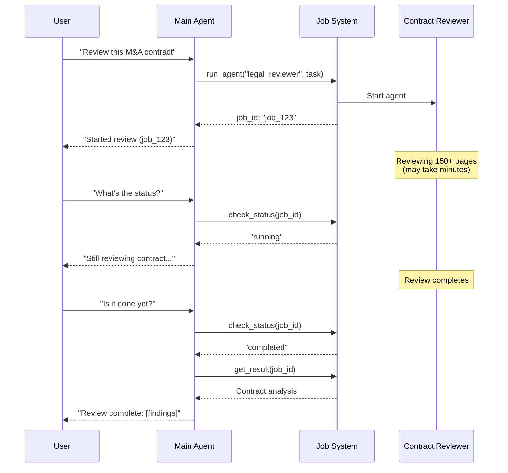
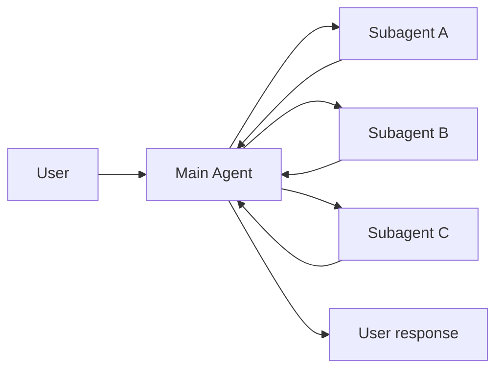
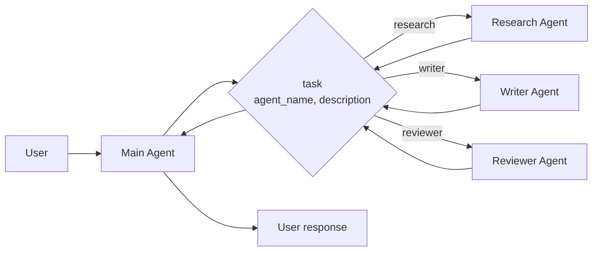
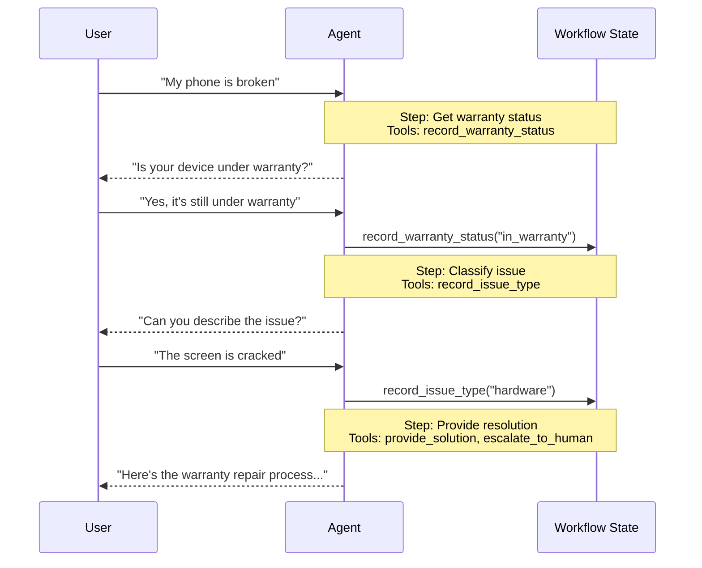
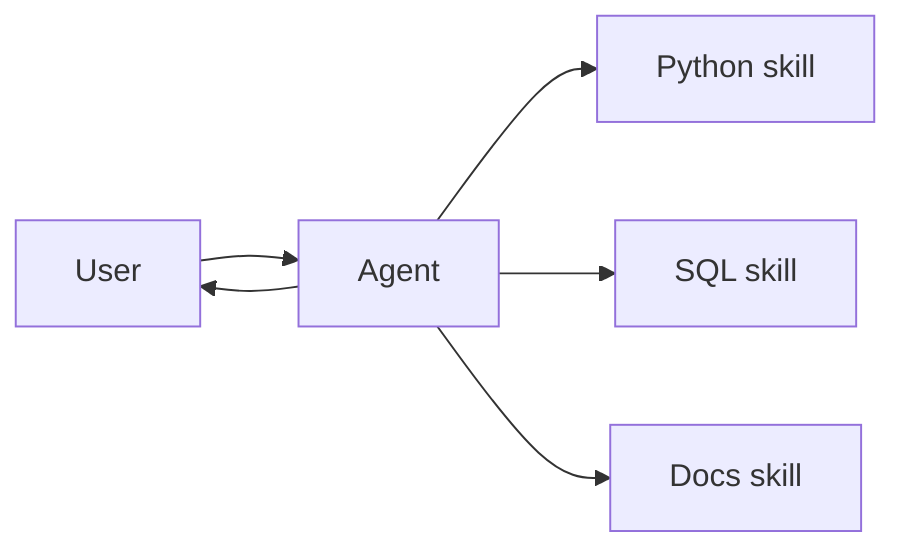
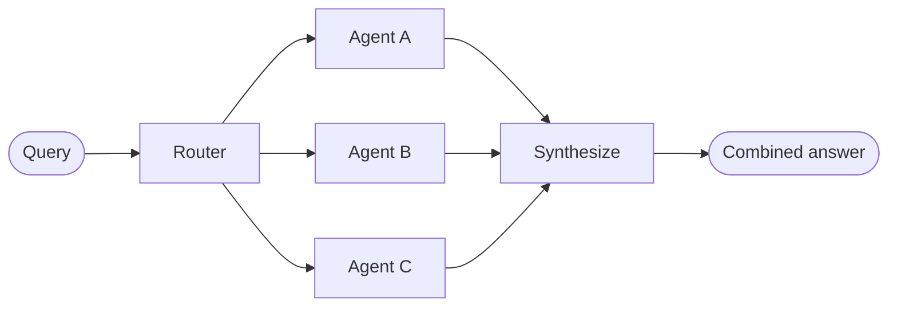
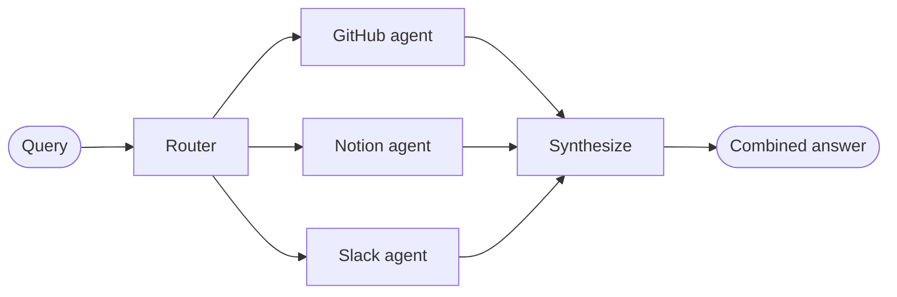
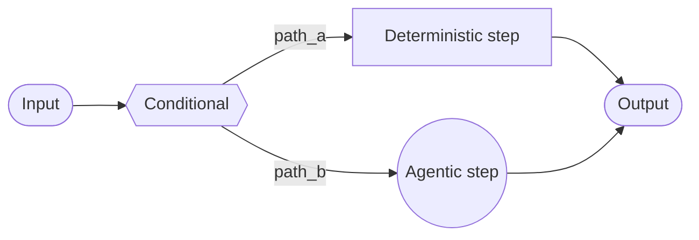
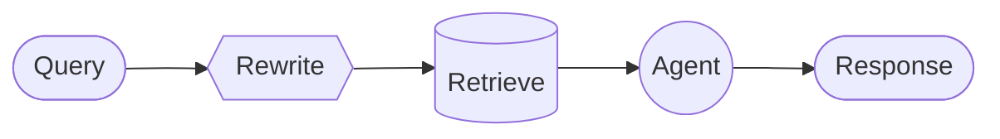

Multi-agent systems break complex applications into coordinated components. **Importantly, "multi-agent" doesn't necessarily mean multiple distinct agents** — a single agent with dynamic behavior can achieve similar capabilities.

## Why multi-agent?

When developers say they need "multi-agent," they're usually looking for one or more of these capabilities:

- <Icon icon="brain" /> **Context management**: Provide specialized knowledge without overwhelming the model's context window. If context were infinite and latency zero, you could dump all knowledge into a single prompt — but since it's not, you need patterns to selectively surface relevant information.
- <Icon icon="users" /> **Distributed development**: Allow different teams to develop and maintain capabilities independently, composing them into a larger system with clear boundaries.
- <Icon icon="code-branch" /> **Parallelization**: Spawn specialized workers for subtasks and execute them concurrently for faster results.
- <Icon icon="list-ol" /> **Sequential constraints**: Enforce step-by-step workflows, unlocking tools and actions only after preconditions are met.

Multi-agent patterns are particularly valuable when a single agent has too many [tools](/oss/python/langchain/tools) and makes poor decisions about which to use, when tasks require specialized knowledge with extensive context (long prompts and domain-specific tools), or when you need to enforce sequential constraints that unlock capabilities only after certain conditions are met.

<Tip>
At the center of multi-agent design is **[context engineering](/oss/python/langchain/context-engineering)**—deciding what information each agent sees. The quality of your system depends on ensuring each agent has access to the right data for its task.
</Tip>

## Patterns

Here are the main patterns for building multi-agent systems, each suited to different use cases:

| Pattern | How it works |
|--------------|--------------|
| [**Subagents**](#subagents) | A main agent coordinates subagents as tools. All routing passes through the main agent, which decides when and how to invoke each subagent. |
| [**Handoffs**](#handoffs) | Behavior changes dynamically based on state. Tool calls update a state variable that triggers routing or configuration changes, switching agents or adjusting the current agent's tools and prompt. |
| [**Skills**](#skills) | Specialized prompts and knowledge loaded on-demand. A single agent stays in control while loading context from skills as needed. |
| [**Router**](#router) | A routing step classifies input and directs it to one or more specialized agents. Results are synthesized into a combined response. |
| [**Custom workflow**](#custom-workflow) | Build bespoke execution flows with LangGraph, mixing deterministic logic and agentic behavior. Embed other patterns as nodes in your workflow. |

**Tool calling** is the primary coordination mechanism across all patterns. Tools can:
- Invoke [subagents](#subagents)
- Update state to trigger routing or configuration changes ([handoffs](#handoffs))
- Load context on-demand with ([skills](#skills))
- Invoke entire multi-agent systems (e.g. wrapping a [router](#router) as a tool)

### Choosing a pattern

Use this table to match your requirements to the right pattern:

| Pattern | Distributed development | Parallelization | Multi-hop | Direct user interaction |
|---------|:-----------------------:|:---------------:|:----------:|:-----------------------:|
| [**Subagents**](#subagents) | ⭐⭐⭐ | ⭐⭐⭐ | ⭐⭐⭐ | — |
| [**Handoffs**](#handoffs) | — | — | ⭐⭐⭐ | ⭐⭐⭐ |
| [**Skills**](#skills) | ⭐⭐⭐ | ⭐⭐ | ⭐⭐⭐ | ⭐⭐⭐ |
| [**Router**](#router) | ⭐⭐ | ⭐⭐⭐ | — | ⭐⭐ |

- **Distributed development**: Can different teams maintain components independently?
- **Parallelization**: Can multiple agents execute concurrently?
- **Multi-hop**: Does the pattern support calling multiple subagents in series?
- **Direct user interaction**: Can subagents converse directly with the user?

<Tip>
    You can mix patterns! For example, a **subagents** architecture can invoke tools that invoke custom workflows or router agents. Subagents can even use the **skills** pattern to load context on-demand. The possibilities are endless!
</Tip>

## Subagents

In the **subagents** architecture, a central main agent (often referred to as a **supervisor**) coordinates subagents by calling them as tools. The main agent decides which subagent to invoke, what input to provide, and how to combine results. Subagents are stateless—they don't remember past interactions, with all conversation memory maintained by the main agent. This provides context isolation: each subagent invocation works in a clean context window, preventing context bloat in the main conversation.

**Key characteristics:**

* Centralized control: All routing passes through the main agent
* No direct user interaction: Subagents return results to the main agent, not the user
* Subagents via tools: Subagents are invoked via tools
* Parallel execution: The main agent can invoke multiple subagents in a single turn

Use the subagents pattern when you have multiple distinct domains (e.g., calendar, email, CRM, database), subagents don't need to converse directly with users, or you want centralized workflow control. For simpler cases with just a few tools, use a single agent.

<Card
    title="Tutorial: Build an agent with subagents"
    icon="sitemap"
    href="/oss/python/langchain/supervisor"
    arrow cta="Learn more"
>
    Learn how to build a personal assistant using the subagents pattern, where a central main agent (supervisor) coordinates specialized worker agents.
</Card>

### Sync vs. async

By default, subagent calls are **synchronous**—the main agent waits for each subagent to complete before continuing. This is simple and works well for most cases.

For **long-running tasks** (reviewing contracts, conducting research, auditing code), use **asynchronous execution**. The main agent kicks off a background job and continues conversing with the user while the work completes.



**Key characteristics:**

* Three-tool pattern: Kick off job (returns job ID), check status, get results
* Asynchronous execution: Work proceeds in the background while main agent remains responsive
* User-initiated checks: Main agent checks job status when the user asks, not on a polling schedule

**Handling job completion:** When a job finishes, your application needs to notify the user. One approach: surface a notification that, when clicked, sends a `HumanMessage` like "Check job_123 and summarize the results."

### Tool patterns

There are two main ways to expose subagents as tools:

| Pattern | Best for | Trade-off |
|---------|----------|-----------|
| [**Tool per agent**](#tool-per-agent) | Fine-grained control over each subagent's input/output | More setup, but more customization |
| [**Single dispatch tool**](#single-dispatch-tool) | Many agents, distributed teams, convention over configuration | Simpler composition, less per-agent customization |

#### Tool per agent



The key idea is wrapping subagents as tools that the main agent can call:

```python
from langchain.tools import tool
from langchain.agents import create_agent

# Create a sub-agent
subagent = create_agent(model="...", tools=[...])  # [!code highlight]

# Wrap it as a tool  # [!code highlight]
@tool("subagent_name", description="subagent_description")  # [!code highlight]
def call_subagent(query: str):  # [!code highlight]
    result = subagent.invoke({"messages": [{"role": "user", "content": query}]})
    return result["messages"][-1].content

# Main agent with subagent as a tool  # [!code highlight]
main_agent = create_agent(model="...", tools=[call_subagent])  # [!code highlight]
```


The main agent invokes the subagent tool when it decides the task matches the subagent's description, receives the result, and continues orchestration. See [Context engineering](#context-engineering) for fine-grained control.

#### Single dispatch tool

An alternative approach uses a single parameterized tool to invoke ephemeral sub-agents for independent tasks. Unlike the [tool per agent](#tool-per-agent) approach where each sub-agent is wrapped as a separate tool, this uses a convention-based approach with a single `task` tool: the task description is passed as a human message to the sub-agent, and the sub-agent's final message is returned as the tool result.

Use this approach when you want to distribute agent development across multiple teams, need to isolate complex tasks into separate context windows, need a scalable way to add new agents without modifying the coordinator, or prefer convention over customization. This approach trades flexibility in context engineering for simplicity in agent composition and strong context isolation.



**Key characteristics:**

* Single task tool: One parameterized tool that can invoke any registered sub-agent by name
* Convention-based invocation: Agent selected by name, task passed as human message, final message returned as tool result
* Team distribution: Different teams can develop and deploy agents independently
* Agent discovery: Sub-agents can be discovered via system prompt (listing available agents) or through [progressive disclosure](/oss/python/langchain/progressive-disclosure-skills) (loading agent information on-demand via tools)

<Tip>
An interesting aspect of this approach is that sub-agents may have the exact same capabilities as the main agent. In such cases, invoking a sub-agent is **really about context isolation** as the primary reason—allowing complex, multi-step tasks to run in isolated context windows without bloating the main agent's conversation history. The sub-agent completes its work autonomously and returns only a concise summary, keeping the main thread focused and efficient.
</Tip>

<Accordion title="Agent registry with task dispatcher">

```python
from langchain.tools import tool
from langchain.agents import create_agent

# Sub-agents developed by different teams
research_agent = create_agent(
    model="gpt-4o",
    prompt="You are a research specialist..."
)

writer_agent = create_agent(
    model="gpt-4o",
    prompt="You are a writing specialist..."
)

# Registry of available sub-agents
SUBAGENTS = {
    "research": research_agent,
    "writer": writer_agent,
}

@tool
def task(
    agent_name: str,
    description: str
) -> str:
    """Launch an ephemeral subagent for a task.

    Available agents:
    - research: Research and fact-finding
    - writer: Content creation and editing
    """
    agent = SUBAGENTS[agent_name]
    result = agent.invoke({
        "messages": [
            {"role": "user", "content": description}
        ]
    })
    return result["messages"][-1].content

# Main coordinator agent
main_agent = create_agent(
    model="gpt-4o",
    tools=[task],
    system_prompt=(
        "You coordinate specialized sub-agents. "
        "Available: research (fact-finding), "
        "writer (content creation). "
        "Use the task tool to delegate work."
    ),
)
```


</Accordion>

### Context engineering

Control how context flows between the main agent and its subagents:

| Category | Purpose | Impacts |
|----------|---------|---------|
| [**Subagent specs**](#subagent-specs) | Ensure subagents are invoked when they should be | Main agent routing decisions |
| [**Subagent inputs**](#subagent-inputs) | Ensure subagents can execute well with optimized context | Subagent performance |
| [**Subagent outputs**](#subagent-outputs) | Ensure the supervisor can act on subagent results | Main agent performance |

See also our comprehensive guide on [context engineering](/oss/python/langchain/context-engineering) for agents.

#### Subagent specs

The **name** and **description** you give a subagent tool determine when the main agent decides to invoke it. These are prompting levers—choose them carefully.

- **Name**: How the main agent refers to the sub-agent. Keep it clear and action-oriented (e.g., `research_agent`, `code_reviewer`).
- **Description**: What the main agent knows about the sub-agent's capabilities. Be specific about what tasks it handles and when to use it.

#### Subagent inputs

Customize what context the subagent receives to execute its task. Add input that isn't practical to capture in a static prompt—full message history, prior results, or task metadata—by pulling from the agent's state.

```python Subagent inputs example expandable
from langchain.agents import AgentState
from langchain.tools import tool, ToolRuntime

class CustomState(AgentState):
    example_state_key: str

@tool(
    "subagent1_name",
    description="subagent1_description"
)
def call_subagent1(query: str, runtime: ToolRuntime[None, CustomState]):
    # Apply any logic needed to transform the messages into a suitable input
    subagent_input = some_logic(query, runtime.state["messages"])
    result = subagent1.invoke({
        "messages": subagent_input,
        # You could also pass other state keys here as needed.
        # Make sure to define these in both the main and subagent's
        # state schemas.
        "example_state_key": runtime.state["example_state_key"]
    })
    return result["messages"][-1].content
```


#### Subagent outputs

Customize what the main agent receives back so it can make good decisions. Two strategies:

1. **Prompt the sub-agent**: Specify exactly what should be returned. A common failure mode is that the sub-agent performs tool calls or reasoning but doesn't include results in its final message—remind it that the supervisor only sees the final output.
2. **Format in code**: Adjust or enrich the response before returning it. For example, pass specific state keys back in addition to the final text using a `Command`.

```python Subagent outputs example expandable
from typing import Annotated
from langchain.agents import AgentState
from langchain.tools import InjectedToolCallId
from langgraph.types import Command


@tool(
    "subagent1_name",
    description="subagent1_description"
)
def call_subagent1(
    query: str,
    tool_call_id: Annotated[str, InjectedToolCallId],
) -> Command:
    result = subagent1.invoke({
        "messages": [{"role": "user", "content": query}]
    })
    return Command(update={
        # Pass back additional state from the subagent
        "example_state_key": result["example_state_key"],
        "messages": [
            ToolMessage(
                content=result["messages"][-1].content,
                tool_call_id=tool_call_id
            )
        ]
    })
```


## Handoffs

In the **handoffs** architecture, behavior changes dynamically based on state. The core mechanism: tools update a state variable (e.g., `current_step` or `active_agent`) that persists across turns, and the system reads this variable to adjust behavior—either applying different configuration (system prompt, tools) or routing to a different agent. This pattern supports both handoffs between distinct agents and dynamic configuration changes within a single agent.

<Tip>
The term **handoffs** was coined by [OpenAI](https://openai.github.io/openai-agents-python/handoffs/) for using tool calls (e.g., `transfer_to_sales_agent`) to transfer control between agents or states.
</Tip>



**Key characteristics:**

* State-driven behavior: Behavior changes based on a state variable (e.g., `current_step` or `active_agent`)
* Tool-based transitions: Tools update the state variable to move between states
* Direct user interaction: Each state's configuration handles user messages directly
* Persistent state: State survives across conversation turns

Use the handoffs pattern when you need to enforce sequential constraints (unlock capabilities only after preconditions are met), the agent needs to converse directly with the user across different states, or you're building multi-stage conversational flows. This pattern is particularly valuable for customer support scenarios where you need to collect information in a specific sequence — for example, collecting a warranty ID before processing a refund.

<Card
    title="Tutorial: Build a customer support agent using handoffs"
    icon="people-arrows"
    href="/oss/python/langchain/customer-support-handoffs"
    arrow cta="Learn more"
>
    Learn how to build a customer support agent using the handoffs pattern, where a single agent transitions between different configurations.
</Card>

There are two ways to implement handoffs: **[single agent with middleware](#single-agent-with-middleware)** (one agent with dynamic configuration) or **[multiple agent subgraphs](#multiple-agent-subgraphs)** (distinct agents as graph nodes).

### Single agent with middleware

A single agent changes its behavior based on state. Middleware intercepts each model call and dynamically adjusts the system prompt and available tools. Tools update the state variable to trigger transitions:

```python
from langchain.tools import ToolRuntime, tool
from langchain.messages import ToolMessage
from langgraph.types import Command

@tool
def record_warranty_status(
    status: str,
    runtime: ToolRuntime[None, SupportState]
) -> Command:
    """Record warranty status and transition to next step."""
    return Command(
        update={
            "messages": [
                ToolMessage(
                    content=f"Warranty status recorded: {status}",
                    tool_call_id=runtime.tool_call_id
                )
            ],
            "warranty_status": status,
            "current_step": "specialist"  # Update state to trigger transition
        }
    )
```


<Accordion title="Complete example: Customer support with middleware">

```python
from langchain.agents import AgentState, create_agent
from langchain.agents.middleware import wrap_model_call, ModelRequest, ModelResponse
from langchain.tools import tool, ToolRuntime
from langchain.messages import ToolMessage
from langgraph.types import Command
from typing import Callable

# 1. Define state with current_step tracker
class SupportState(AgentState):  # [!code highlight]
    """Track which step is currently active."""
    current_step: str = "triage"  # [!code highlight]
    warranty_status: str | None = None

# 2. Tools update current_step via Command
@tool
def record_warranty_status(
    status: str,
    runtime: ToolRuntime[None, SupportState]
) -> Command:  # [!code highlight]
    """Record warranty status and transition to next step."""
    return Command(update={  # [!code highlight]
        "messages": [  # [!code highlight]
            ToolMessage(
                content=f"Warranty status recorded: {status}",
                tool_call_id=runtime.tool_call_id
            )
        ],
        "warranty_status": status,
        # Transition to next step
        "current_step": "specialist"    # [!code highlight]
    })

# 3. Middleware applies dynamic configuration based on current_step
@wrap_model_call  # [!code highlight]
def apply_step_config(
    request: ModelRequest,
    handler: Callable[[ModelRequest], ModelResponse]
) -> ModelResponse:
    """Configure agent behavior based on current_step."""
    step = request.state.get("current_step", "triage")  # [!code highlight]

    # Map steps to their configurations
    configs = {
        "triage": {
            "prompt": "Collect warranty information...",
            "tools": [record_warranty_status]
        },
        "specialist": {
            "prompt": "Provide solutions based on warranty: {warranty_status}",
            "tools": [provide_solution, escalate]
        }
    }

    config = configs[step]
    request = request.override(  # [!code highlight]
        system_prompt=config["prompt"].format(**request.state),  # [!code highlight]
        tools=config["tools"]  # [!code highlight]
    )
    return handler(request)

# 4. Create agent with middleware
agent = create_agent(
    model,
    tools=[record_warranty_status, provide_solution, escalate],
    state_schema=SupportState,
    middleware=[apply_step_config],  # [!code highlight]
    checkpointer=InMemorySaver()  # Persist state across turns  # [!code highlight]
)
```


</Accordion>

### Multiple agent subgraphs

Multiple distinct agents exist as separate nodes in a graph. Handoff tools navigate between agent nodes using `Command.PARENT` to specify which node to execute next:

```python
@tool
def transfer_to_sales():
    """Transfer to the sales agent."""
    return Command(
        # Navigate to the sales agent node
        goto="sales_agent",  # [!code highlight]
        # Update the state to indicate the sales agent is active
        update={"active_agent": "sales_agent"},  # [!code highlight]
        graph=Command.PARENT  # Navigate in parent graph
    )
```


<Accordion title="Complete example: Sales and support with handoffs">

This example shows a multi-agent system with separate sales and support agents. Each agent is a separate graph node, and handoff tools allow agents to transfer conversations to each other.

```python
from typing import Literal
from langchain.agents import AgentState, create_agent
from langchain.tools import tool
from langgraph.graph import StateGraph, START
from langgraph.types import Command

# 1. Define state with active_agent tracker
class MultiAgentState(AgentState):
    active_agent: str = "sales_agent"  # Track which agent is active

# 2. Create handoff tools
@tool
def transfer_to_sales():
    """Transfer to the sales agent."""
    return Command(
        goto="sales_agent",
        update={"active_agent": "sales_agent"},
        graph=Command.PARENT
    )

@tool
def transfer_to_support():
    """Transfer to the support agent."""
    return Command(
        goto="support_agent",
        update={"active_agent": "support_agent"},
        graph=Command.PARENT
    )

# 3. Create agents with handoff tools
sales_agent = create_agent(
    model="anthropic:claude-3-5-sonnet-latest",
    tools=[transfer_to_support],
    prompt="You are a sales agent. Help with sales inquiries."
)

support_agent = create_agent(
    model="anthropic:claude-3-5-sonnet-latest",
    tools=[transfer_to_sales],
    prompt="You are a support agent. Help with technical issues."
)

# 4. Create agent nodes that invoke the agents
def call_sales_agent(state: MultiAgentState):
    """Node that calls the sales agent."""
    response = sales_agent.invoke(state)
    return response

def call_support_agent(state: MultiAgentState):
    """Node that calls the support agent."""
    response = support_agent.invoke(state)
    return response

# 5. Create router node
def route_to_agent(state: MultiAgentState) -> Literal["sales_agent", "support_agent"]:
    """Route to the active agent based on state."""
    return state["active_agent"]

# 6. Build the graph
builder = StateGraph(MultiAgentState)
builder.add_node("sales_agent", call_sales_agent)
builder.add_node("support_agent", call_support_agent)

# Start with conditional routing based on initial active_agent
builder.add_conditional_edges(
    START,
    route_to_agent,
    ["sales_agent", "support_agent"]
)

# After each agent, route to the active agent (enables handoffs)
builder.add_conditional_edges(
    "sales_agent",
    route_to_agent,
    ["sales_agent", "support_agent"]
)
builder.add_conditional_edges(
    "support_agent",
    route_to_agent,
    ["sales_agent", "support_agent"]
)

graph = builder.compile()
```


</Accordion>

<Tip>
Use **single agent with middleware** for most handoffs use cases—it's simpler. Only use **multiple agent subgraphs** when you need bespoke agent implementations (e.g., a node that's itself a complex graph with reflection or retrieval steps).
</Tip>

**Implementation considerations:**

* **Conversation history**: Decide what conversation history each agent/state receives—full history, filtered portions, or summaries.
* **Tool semantics**: Clarify whether handoff tools only update routing state or also perform actions (e.g., should `transfer_to_sales()` also create a ticket?).


## Skills

In the **skills** architecture, specialized capabilities are packaged as invokable "skills" that augment an agent's behavior. Skills are primarily prompt-driven specializations that an agent can invoke on-demand.



**Key characteristics:**

* Prompt-driven specialization: Skills are primarily defined by specialized prompts
* Progressive disclosure: Skills become available based on context or user needs
* Team distribution: Different teams can develop and maintain skills independently
* Lightweight composition: Skills are simpler than full sub-agents

Use the skills pattern when you want a single agent with many possible specializations, you don't need to enforce specific constraints between skills, or different teams need to develop capabilities independently. Common examples include coding assistants (skills for different languages or tasks), knowledge bases (skills for different domains), and creative assistants (skills for different formats).

<Tip>
This pattern is conceptually identical to [llms.txt](https://llmstxt.org/) (introduced by Jeremy Howard), which uses tool calling for progressive disclosure of documentation. The skills pattern applies the same approach to specialized prompts and domain knowledge rather than just documentation pages.
</Tip>

```python Loading skills on-demand expandable
from langchain.tools import tool
from langchain.agents import create_agent

@tool
def load_skill(skill_name: str) -> str:
    """Load a specialized skill prompt.

    Available skills:
    - write_sql: SQL query writing expert
    - review_legal_doc: Legal document reviewer

    Returns the skill's prompt and context.
    """
    # Load skill content from file/database
    ...

agent = create_agent(
    model="gpt-4o",
    tools=[load_skill],
    system_prompt=(
        "You are a helpful assistant. "
        "You have access to two skills: "
        "write_sql and review_legal_doc. "
        "Use load_skill to access them."
    ),
)
```


### Extending the pattern

When writing custom implementations, you can extend the basic skills pattern in several ways:

- **Dynamic tool registration**: Combine progressive disclosure with state management to register new tools as skills load. For example, loading a "database_admin" skill could both add specialized context and register database-specific tools (backup, restore, migrate). This uses the same tool-and-state mechanisms used across multi-agent patterns—tools updating state to dynamically change agent capabilities.

- **Hierarchical skills**: Skills can define other skills in a tree structure, creating nested specializations. For instance, loading a "data_science" skill might make available sub-skills like "pandas_expert", "visualization", and "statistical_analysis". Each sub-skill can be loaded independently as needed, allowing for fine-grained progressive disclosure of domain knowledge. This hierarchical approach helps manage large knowledge bases by organizing capabilities into logical groupings that can be discovered and loaded on-demand.

<Card
    title="Tutorial: Build an agent with on-demand skill loading"
    icon="wand-magic-sparkles"
    href="/oss/python/langchain/progressive-disclosure-skills"
    arrow cta="Learn more"
>
    Learn how to implement skills with progressive disclosure, where the agent loads specialized prompts and schemas on-demand rather than upfront.
</Card>


## Router

In the **router** architecture, a routing step classifies input and directs it to specialized agents. This is useful when you have distinct **verticals**—separate knowledge domains that each require their own agent.



Key characteristics:

* Router decomposes the query
* Zero or more specialized agents are invoked in parallel
* Results are synthesized into a coherent response

Two approaches:
* [**Stateless routers**](#stateless) address each request independently
* [**Stateful routers**](#stateful) maintain conversation history across requests

### Stateless

Each request is routed independently—no memory between calls. For multi-turn conversations, see [Stateful routers](#stateful).

<Tip>
**Stateless router vs. Subagents**: The [subagents pattern](#subagents) can also route to multiple agents. Use the stateless router when you need specialized preprocessing or custom routing logic. Use the subagents pattern when you want the LLM to decide which agents to call dynamically.
</Tip>

<Accordion title="Building a multi-source knowledge base router">

Your organization's knowledge lives in multiple places: GitHub repositories, Notion wikis, and Slack conversations. These are three distinct verticals, each requiring specialized tools and context. When users ask questions like "How do I authenticate API requests?", the answer may require information from multiple sources. This example builds a router that decomposes queries, identifies which verticals to consult, queries them in parallel, and synthesizes results.



```python
from typing import TypedDict
from langgraph.graph import StateGraph, START, END, Send
from langchain.agents import create_agent
from langchain_openai import ChatOpenAI

class RouterState(TypedDict):
    query: str
    routes: list[str]  # Which knowledge bases to query
    github_result: str | None
    notion_result: str | None
    slack_result: str | None
    final_answer: str

# Specialized agents for each vertical
github_agent = create_agent(
    model="openai:gpt-4o",
    tools=[search_code, search_issues, search_prs],
    prompt="You are a GitHub expert. Answer questions about code, API references, and implementation details.",
    name="github_agent"
)

notion_agent = create_agent(
    model="openai:gpt-4o",
    tools=[search_notion, get_page],
    prompt="You are a Notion expert. Answer questions about internal processes, policies, and team documentation.",
    name="notion_agent"
)

slack_agent = create_agent(
    model="openai:gpt-4o",
    tools=[search_slack, get_thread],
    prompt="You are a Slack expert. Answer questions by searching relevant threads and discussions.",
    name="slack_agent"
)

router_llm = ChatOpenAI(model="gpt-4o-mini")

def decompose_query(state: RouterState) -> dict:  # [!code highlight]
    """Decompose query and determine which knowledge bases to consult."""  # [!code highlight]
    response = router_llm.invoke([
        {
            "role": "system",
            "content": "Analyze this query and determine which knowledge bases to consult. Return a JSON list with one or more of: 'github', 'notion', 'slack'."
        },
        {"role": "user", "content": state["query"]}
    ])
    # Parse LLM response to get routes (simplified for example)
    routes = ["github", "notion"]  # In practice, parse from LLM response
    return {"routes": routes}

# Route to multiple agents in parallel  # [!code highlight]
def route_to_agents(state: RouterState) -> list[Send]:  # [!code highlight]
    """Fan out to multiple agents in parallel."""  # [!code highlight]
    return [Send(route, state) for route in state["routes"]]  # [!code highlight]

def query_github(state: RouterState) -> dict:
    result = github_agent.invoke({
        "messages": [{"role": "user", "content": state["query"]}]
    })
    return {"github_result": result["messages"][-1].content}

def query_notion(state: RouterState) -> dict:
    result = notion_agent.invoke({
        "messages": [{"role": "user", "content": state["query"]}]
    })
    return {"notion_result": result["messages"][-1].content}

def query_slack(state: RouterState) -> dict:
    result = slack_agent.invoke({
        "messages": [{"role": "user", "content": state["query"]}]
    })
    return {"slack_result": result["messages"][-1].content}

def synthesize_results(state: RouterState) -> dict:  # [!code highlight]
    """Combine results from multiple agents into a coherent answer."""  # [!code highlight]
    results = []
    if state.get("github_result"):
        results.append(f"GitHub: {state['github_result']}")
    if state.get("notion_result"):
        results.append(f"Notion: {state['notion_result']}")
    if state.get("slack_result"):
        results.append(f"Slack: {state['slack_result']}")

    # Use LLM to synthesize
    synthesis_response = router_llm.invoke([
        {"role": "system", "content": "Synthesize these search results into a coherent answer."},
        {"role": "user", "content": "\n\n".join(results)}
    ])
    return {"final_answer": synthesis_response.content}

# Build workflow with parallel execution
workflow = (
    StateGraph(RouterState)
    .add_node("decompose", decompose_query)
    .add_node("github", query_github)
    .add_node("notion", query_notion)
    .add_node("slack", query_slack)
    .add_node("synthesize", synthesize_results)
    .add_edge(START, "decompose")
    .add_conditional_edges("decompose", route_to_agents, ["github", "notion", "slack"])  # [!code highlight]
    .add_edge("github", "synthesize")
    .add_edge("notion", "synthesize")
    .add_edge("slack", "synthesize")
    .add_edge("synthesize", END)
    .compile()
)

result = workflow.invoke({"query": "How do I authenticate API requests?"})
print(result["final_answer"])
```


</Accordion>


### Stateful

For multi-turn conversations, you need to maintain context across invocations.

#### Tool wrapper

The simplest approach: wrap the stateless router as a tool that a conversational agent can call. The conversational agent handles memory and context; the router stays stateless. This avoids the complexity of managing conversation history across multiple parallel agents.

```python
@tool
def search_docs(query: str) -> str:
    """Search across multiple documentation sources."""
    result = workflow.invoke({"query": query})  # [!code highlight]
    return result["final_answer"]

# Conversational agent uses the router as a tool
conversational_agent = create_agent(
    model,
    tools=[search_docs],
    prompt="You are a helpful assistant. Use search_docs to answer questions."
)
```


#### Full persistence

If you need the router itself to maintain state, use [persistence](/oss/python/langchain/short-term-memory) to store message history. When routing to an agent, fetch previous messages from state and selectively include them in the agent's context—this is a lever for [context engineering](/oss/python/langchain/context-engineering).

<Warning>
**Stateful routers require custom history management.** If the router switches between agents across turns, conversations may not feel fluid to end users when agents have different tones or prompts. With parallel invocation, you'll need to maintain history at the router level (inputs and synthesized outputs) and leverage this history in routing logic. Consider the [handoffs pattern](#handoffs) or [subagents pattern](#subagents) instead—both provide clearer semantics for multi-turn conversations.
</Warning>

## Custom workflow

In the **custom workflow** architecture, you define your own bespoke execution flow using LangGraph. You have complete control over the graph structure—including sequential steps, conditional branches, loops, and parallel execution.

Use custom workflows when:
- Standard patterns (subagents, skills, etc.) don't fit your requirements
- You need to mix deterministic logic with agentic behavior
- Your use case requires complex routing or multi-stage processing

Each node in your workflow can be a simple function, an LLM call, or an entire agent with tools. You can also compose other architectures within a custom workflow—for example, embedding a multi-agent system as a single node.



The [router pattern](#router) is an example of a custom workflow.

<Tip>
**Calling a LangChain agent from a LangGraph node**: The main insight when mixing LangChain and LangGraph is that you can call a LangChain agent directly inside any LangGraph node. This lets you combine the flexibility of custom workflows with the convenience of pre-built agents:

```python
from langchain.agents import create_agent

agent = create_agent(model="openai:gpt-4o", tools=[...])

def agent_node(state: State) -> dict:
    """A LangGraph node that invokes a LangChain agent."""
    result = agent.invoke({
        "messages": [{"role": "user", "content": state["query"]}]
    })
    return {"answer": result["messages"][-1].content}
```


</Tip>

**Example: RAG pipeline** — A common use case is combining retrieval with an agent. This example builds a WNBA stats assistant that retrieves from a knowledge base and can fetch live news.

<Accordion title="Custom RAG workflow">

The workflow demonstrates three types of nodes:

- **Model node** (Rewrite): Rewrites the user query for better retrieval using structured output.
- **Deterministic node** (Retrieve): Performs vector similarity search — no LLM involved.
- **Agent node** (Agent): Reasons over retrieved context and can fetch additional information via tools.



<Tip>
You can use LangGraph state to pass information between workflow steps. This allows each part of your workflow to read and update structured fields, making it easy to share data and context across nodes.
</Tip>

```python
from typing import TypedDict
from pydantic import BaseModel
from langgraph.graph import StateGraph, START, END
from langchain.agents import create_agent
from langchain.tools import tool
from langchain_openai import ChatOpenAI, OpenAIEmbeddings
from langchain_core.vectorstores import InMemoryVectorStore

class State(TypedDict):
    question: str
    rewritten_query: str
    documents: list[str]
    answer: str

# WNBA knowledge base with rosters, game results, and player stats
embeddings = OpenAIEmbeddings()
vector_store = InMemoryVectorStore(embeddings)
vector_store.add_texts([
    # Rosters
    "New York Liberty 2024 roster: Breanna Stewart, Sabrina Ionescu, Jonquel Jones, Courtney Vandersloot.",
    "Las Vegas Aces 2024 roster: A'ja Wilson, Kelsey Plum, Jackie Young, Chelsea Gray.",
    "Indiana Fever 2024 roster: Caitlin Clark, Aliyah Boston, Kelsey Mitchell, NaLyssa Smith.",
    # Game results
    "2024 WNBA Finals: New York Liberty defeated Minnesota Lynx 3-2 to win the championship.",
    "June 15, 2024: Indiana Fever 85, Chicago Sky 79. Caitlin Clark had 23 points and 8 assists.",
    "August 20, 2024: Las Vegas Aces 92, Phoenix Mercury 84. A'ja Wilson scored 35 points.",
    # Player stats
    "A'ja Wilson 2024 season stats: 26.9 PPG, 11.9 RPG, 2.6 BPG. Won MVP award.",
    "Caitlin Clark 2024 rookie stats: 19.2 PPG, 8.4 APG, 5.7 RPG. Won Rookie of the Year.",
    "Breanna Stewart 2024 stats: 20.4 PPG, 8.5 RPG, 3.5 APG.",
])
retriever = vector_store.as_retriever(search_kwargs={"k": 5})

@tool
def get_latest_news(query: str) -> str:
    """Get the latest WNBA news and updates."""
    # Your news API here
    return "Latest: The WNBA announced expanded playoff format for 2025..."

agent = create_agent(
    model="openai:gpt-4o",
    tools=[get_latest_news],
)

model = ChatOpenAI(model="gpt-4o")

class RewrittenQuery(BaseModel):
    query: str

def rewrite_query(state: State) -> dict:
    """Rewrite the user query for better retrieval."""
    system_prompt = """Rewrite this query to retrieve relevant WNBA information.
The knowledge base contains: team rosters, game results with scores, and player statistics (PPG, RPG, APG).
Focus on specific player names, team names, or stat categories mentioned."""
    response = model.with_structured_output(RewrittenQuery).invoke([
        {"role": "system", "content": system_prompt},
        {"role": "user", "content": state["question"]}
    ])
    return {"rewritten_query": response.query}

def retrieve(state: State) -> dict:
    """Retrieve documents based on the rewritten query."""
    docs = retriever.invoke(state["rewritten_query"])
    return {"documents": [doc.page_content for doc in docs]}

def call_agent(state: State) -> dict:
    """Generate answer using retrieved context."""
    context = "\n\n".join(state["documents"])
    prompt = f"Context:\n{context}\n\nQuestion: {state['question']}"
    response = agent.invoke({"messages": [{"role": "user", "content": prompt}]})
    return {"answer": response["messages"][-1].content_blocks}

workflow = (
    StateGraph(State)
    .add_node("rewrite", rewrite_query)
    .add_node("retrieve", retrieve)
    .add_node("agent", call_agent)
    .add_edge(START, "rewrite")
    .add_edge("rewrite", "retrieve")
    .add_edge("retrieve", "agent")
    .add_edge("agent", END)
    .compile()
)

result = workflow.invoke({"question": "Who won the 2024 WNBA Championship?"})
print(result["answer"])
```


</Accordion>

## Performance comparison

Understanding how different patterns affect performance helps you optimize for latency and cost. We'll compare patterns across three scenarios, measuring:
- **Model calls**: Number of LLM invocations (each time the model is called to generate a response or tool call)
- **Tokens processed**: Total context window usage across all calls

### Scenario 1: Single task

> **User:** "Buy milk"

There's a specialized milk agent/skill that can call a `buy_milk` tool.

| Pattern | Model calls | Winner |
|---------|:-----------:|:------:|
| [**Subagents**](#subagents) | **4** | |
| [**Handoffs**](#handoffs) | **3** | ⭐ |
| [**Skills**](#skills) | **3** | ⭐ |
| [**Router**](#router) | **3** | ⭐ |

<Tabs>
  <Tab title="Subagents">
    **4 model calls:**
    ```mermaid
    sequenceDiagram
        participant User
        participant Main Agent
        participant Milk Subagent
        participant buy_milk tool

        User->>Main Agent: "Buy milk"
        Note over Main Agent: Call 1
        Main Agent->>Milk Subagent: milk_subagent()
        Note over Milk Subagent: Call 2
        Milk Subagent->>buy_milk tool: buy_milk()
        buy_milk tool-->>Milk Subagent: Done
        Note over Milk Subagent: Call 3
        Milk Subagent-->>Main Agent: "Bought milk"
        Note over Main Agent: Call 4
        Main Agent-->>User: "I bought milk for you"
    ```
  </Tab>

  <Tab title="Handoffs">
    **3 model calls:**
    ```mermaid
    sequenceDiagram
        participant User
        participant Main Agent
        participant Milk Agent
        participant buy_milk tool

        User->>Main Agent: "Buy milk"
        Note over Main Agent: Call 1
        Main Agent->>Milk Agent: transfer_to_milk_agent()
        Note over Milk Agent: Call 2
        Milk Agent->>buy_milk tool: buy_milk()
        buy_milk tool-->>Milk Agent: Done
        Note over Milk Agent: Call 3
        Milk Agent-->>User: "I bought milk for you"
    ```
  </Tab>

  <Tab title="Skills">
    **3 model calls:**
    ```mermaid
    sequenceDiagram
        participant User
        participant Agent
        participant load_skill tool
        participant buy_milk tool

        User->>Agent: "Buy milk"
        Note over Agent: Call 1
        Agent->>load_skill tool: load_skill("milk")
        load_skill tool-->>Agent: Milk skill context
        Note over Agent: Call 2
        Agent->>buy_milk tool: buy_milk()
        buy_milk tool-->>Agent: Done
        Note over Agent: Call 3
        Agent-->>User: "I bought milk for you"
    ```
  </Tab>

  <Tab title="Router">
    **3 model calls:**
    ```mermaid
    sequenceDiagram
        participant User
        participant Router LLM
        participant Milk Agent
        participant buy_milk tool

        User->>Router LLM: "Buy milk"
        Note over Router LLM: Call 1: Route to milk agent
        Router LLM->>Milk Agent: Invoke with query
        Note over Milk Agent: Call 2
        Milk Agent->>buy_milk tool: buy_milk()
        buy_milk tool-->>Milk Agent: Done
        Note over Milk Agent: Call 3
        Milk Agent-->>User: "I bought milk for you"
    ```
  </Tab>
</Tabs>

**Key insight:** Handoffs, Skills, and Router are most efficient for single tasks (3 calls each). Subagents adds one extra call because results flow back through the main agent—this overhead provides centralized control.

### Scenario 2: Follow-up request

> **Turn 1:** "Buy milk"
> **Turn 2:** "Buy milk again"

The user makes a follow-up request in the same conversation.

| Pattern | Turn 2 calls | Total (both turns) | Winner |
|---------|:------------:|:------------------:|:------:|
| [**Subagents**](#subagents) | **4** | **8** | |
| [**Handoffs**](#handoffs) | **2** | **5** | ⭐ |
| [**Skills**](#skills) | **2** | **5** | ⭐ |
| [**Router**](#router) | **3** | **6** | |

<Accordion title="Why the difference?">

**Subagents (4 calls again → 8 total):**
- Subagents are **stateless by design**—each invocation follows the same flow
- The main agent maintains conversation context, but subagents start fresh each time
- This provides strong context isolation but repeats the full flow

**Handoffs (2 calls → 5 total):**
- The milk agent is **still active** from turn 1 (state persists)
- No handoff needed—agent directly calls `buy_milk` tool (call 1)
- Agent responds to user (call 2)
- **Saves 1 call by skipping the handoff**

**Skills (2 calls → 5 total):**
- The skill context is **already loaded** in conversation history
- No need to reload—agent directly calls `buy_milk` tool (call 1)
- Agent responds to user (call 2)
- **Saves 1 call by reusing loaded skill**

**Router (3 calls again → 6 total):**
- Routers are **stateless**—each request requires an LLM routing call
- Turn 2: Router LLM call (1) → Milk agent calls buy_milk (2) → Milk agent responds (3)
- Can be optimized by wrapping as a tool in a stateful agent

</Accordion>

**Key insight:** Stateful patterns (Handoffs, Skills) save 40-50% of calls on follow-up requests. Subagents maintain consistent cost per request—this stateless design provides strong context isolation but at the cost of repeated model calls.

### Scenario 3: Multiple domains with large context

> **User:** "Compare Python, JavaScript, and Rust for web development"

Each language skill contains ~2000 tokens of documentation. All patterns can make parallel tool calls.

| Pattern | Model calls | Total tokens | Winner |
|---------|:-----------:|:------------:|:------:|
| [**Subagents**](#subagents) | **5** | **~9K** | ⭐ |
| [**Handoffs**](#handoffs) | **7+** | **~14K+** | |
| [**Skills**](#skills) | **3** | **~15K** | |
| [**Router**](#router) | **5** | **~9K** | ⭐ |

<Accordion title="Token and call breakdown">

**Subagents (5 calls, ~9K tokens):**
```
Call 1: Main agent (1K tokens)
  ├─ Calls 3 subagents in parallel
Call 2: Python subagent (2K tokens) ─┐
Call 3: JavaScript subagent (2K tokens) ├─ Parallel
Call 4: Rust subagent (2K tokens) ─────┘
Call 5: Main synthesizes (2K tokens)

Total: 1K + 2K + 2K + 2K + 2K = 9K tokens
```

Each subagent works in **isolation** with only its relevant context.

**Handoffs (7+ calls, ~14K+ tokens):**
```
Call 1: Main agent handoff to Python (1K)
Call 2-3: Python agent researches (2-3 calls, ~2K each)
Call 4: Handoff to JavaScript agent (included in Python's response)
Call 5-6: JavaScript agent researches (2-3 calls, ~2K each)
Call 7: Handoff to Rust agent (included in JS's response)
Call 8-9: Rust agent researches (2-3 calls, ~2K each)

Total: ~14K+ tokens across sequential handoffs
```

Handoffs executes **sequentially**—can't research all three languages in parallel. Growing conversation history adds overhead.

**Router (5 calls, ~9K tokens):**
```
Call 1: Router LLM analyzes query (1K tokens)
  ├─ Routes to Python, JavaScript, Rust agents
Call 2: Python agent (2K tokens) ─┐
Call 3: JavaScript agent (2K tokens) ├─ Parallel
Call 4: Rust agent (2K tokens) ─────┘
Call 5: Synthesis LLM combines results (2K tokens)

Total: 1K + 2K + 2K + 2K + 2K = 9K tokens
```

Router uses an **LLM for routing**, then invokes agents in parallel. Similar to Subagents but with explicit routing step.

**Skills (3 calls, ~15K tokens):**
```
Call 1: Load 3 skills (1K tokens)
  └─ Adds Python (2K) + JavaScript (2K) + Rust (2K) = 6K to context

Call 2: Research (7K tokens)
  └─ Base (1K) + ALL skill contexts (6K) = 7K total

Call 3: Synthesize (7K tokens)
  └─ Base (1K) + ALL skill contexts (6K) = 7K total

Total: 1K + 7K + 7K = 15K tokens
```

After loading, **every subsequent call processes all 6K tokens of skill documentation**.

**The trade-off:**
- Skills: ✅ Fewer calls (3) → ❌ Higher tokens per call (7K+)
- Subagents: ❌ More calls (5) → ✅ Lower tokens per call (1-2K)
- **Result:** Subagents processes 67% fewer tokens overall

</Accordion>

**Key insight:** For multi-domain tasks, patterns with parallel execution (Subagents, Router) are most efficient. Skills has fewer calls but high token usage due to context accumulation. Handoffs is inefficient here—it must execute sequentially and can't leverage parallel tool calling for consulting multiple domains simultaneously.

<Warning>
**When to avoid Skills**: The Skills pattern is ideal for 1-2 lightweight skills. When you need many skills with extensive documentation (API references, detailed examples, comprehensive guidelines), use **Subagents** or **Router** instead. Context isolation prevents repeatedly processing accumulated documentation.
</Warning>

### Summary

Here's how patterns compare across all three scenarios:

| Pattern | Single task | Follow-up | Multiple domains | Best for |
|---------|:-----------:|:---------:|:----------------:|----------|
| [**Subagents**](#subagents) | 4 calls | 8 calls (4+4) | 5 calls, 9K tokens | Parallel execution, context isolation, distributed teams |
| [**Handoffs**](#handoffs) | 3 calls | 5 calls (3+2) | 7+ calls, 14K+ tokens | Multi-turn conversations, direct user interaction, sequential workflows |
| [**Skills**](#skills) | 3 calls | 5 calls (3+2) | 3 calls, 15K tokens | 1-2 lightweight skills, simple context needs |
| [**Router**](#router) | 3 calls | 6 calls (3+3) | 5 calls, 9K tokens | Parallel execution, distinct verticals, explicit routing logic |

**Choosing a pattern:**
- **Optimize for single requests?** → Handoffs, Skills, or Router (3 calls each)
- **Optimize for conversations?** → Handoffs or Skills (stateful, save calls on follow-ups)
- **Need parallel execution?** → Subagents or Router (invoke multiple agents simultaneously)
- **Multiple large-context domains?** → Subagents or Router (context isolation prevents bloat)
- **Simple, focused task?** → Skills (lightweight, minimal overhead)

---

<Callout icon="pen-to-square" iconType="regular">
    [Edit the source of this page on GitHub.](https://github.com/langchain-ai/docs/edit/main/src/oss/langchain/multi-agent.mdx)
</Callout>
<Tip icon="terminal" iconType="regular">
    [Connect these docs programmatically](/use-these-docs) to Claude, VSCode, and more via MCP for real-time answers.
</Tip>
