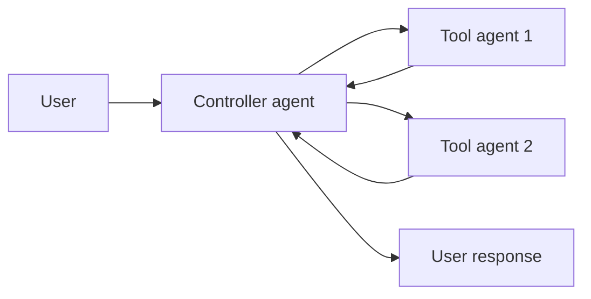
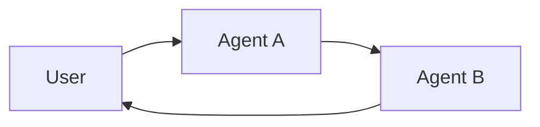
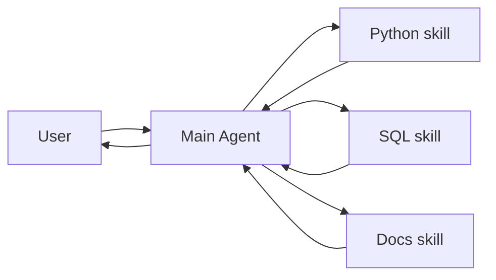

**Multi-agent systems** break a complex application into multiple specialized agents that work together to solve problems.
Instead of relying on a single agent to handle every step, **multi-agent architectures** allow you to compose smaller, focused agents into a coordinated workflow.

Multi-agent systems are useful when:

* A single agent has too many [tools](/oss/langchain/tools) and makes poor decisions about which to use.
* [Context](/oss/concepts/context) or [memory](/oss/langchain/short-term-memory) grows too large for one agent to track effectively.
* Tasks require **specialization** (e.g., a planner, researcher, math expert).

## Multi-agent context engineering

At the center of multi-agent design is <Tooltip tip="The practice of carefully designing what information (prompts, history, state) is available to an LLM at each step">**[context engineering](/oss/langchain/context-engineering)**</Tooltip> — deciding what information each agent sees. LangChain gives you fine-grained control over:

* Which parts of the conversation or state are passed to each agent.
* Specialized prompts tailored to sub-agents.
* Inclusion/exclusion of intermediate reasoning.
* Customizing input/output formats per agent.

The quality of your system depends on context engineering. The goal is to ensure that each agent has access to the correct data it needs to perform its task, whether it's acting as a tool or as an active agent.

## Multi-agent patterns

There are three main multi-agent patterns:

| Pattern | How it works | Example use case |
|---------|--------------|------------------|
| [**Tool calling**](#tool-calling) | A supervisor agent calls other agents as tools. **Centralized** control — all routing passes through the supervisor. | Task orchestration, parallel execution |
| [**Handoffs**](#handoffs) | Agents transfer control to each other via tool calls or graph edges. **Decentralized** — the active agent changes dynamically. | Customer support, multi-domain conversations |
| [**Skills**](#skills) | Specialized prompts loaded **on-demand**. The main agent stays in control and gains additional context as needed. | Progressive disclosure, large knowledge bases |

<Tip>
    You can mix patterns! For example, use **handoffs** for agent switching and have each agent **call sub-agents as tools** for specialized tasks, or have a supervisor invoke **skills** at certain stages.
</Tip>

{/* TODO: insert how to decide table or flow chart or something!! */}

## Tool calling

In tool calling, one agent (the **controller**) treats other agents as *tools* to be invoked when needed. The controller manages orchestration, while tool agents perform specific tasks and return results.

<Steps>
  <Step title="Controller receives input">
    The controller agent receives input and decides which tool (sub-agent) to call.
  </Step>
  <Step title="Tool agent executes">
    The tool agent runs its task based on the controller's instructions.
  </Step>
  <Step title="Results returned">
    The tool agent returns results to the controller.
  </Step>
  <Step title="Controller continues">
    The controller decides the next step or finishes.
  </Step>
</Steps>




<Tip>
    Agents used as tools are generally **not expected** to continue the conversation with the user. Their role is to perform a task and return results to the controller agent. If you need sub-agents to be able to converse with the user, use [handoffs](#handoffs) instead.
</Tip>

Use tool calling when you have multiple distinct domains (e.g., calendar, email, CRM), each with its own tools or complex logic, and you want centralized workflow control. For simpler cases with just a few tools, use a single agent.

<Card
    title="Tutorial: Build a supervisor agent"
    icon="sitemap"
    href="/oss/langchain/supervisor"
    arrow cta="Learn more"
>
    Learn how to build a personal assistant using the supervisor pattern, where a central supervisor agent coordinates specialized worker agents.
</Card>

### Example

The example below shows how a main agent is given access to a single sub-agent via a tool definition:

:::python
```python
from langchain.tools import tool
from langchain.agents import create_agent


subagent1 = create_agent(model="...", tools=[...])

@tool(
    "subagent1_name",
    description="subagent1_description"
)
def call_subagent1(query: str):
    result = subagent1.invoke({
        "messages": [{"role": "user", "content": query}]
    })
    return result["messages"][-1].content

agent = create_agent(model="...", tools=[call_subagent1])
```
:::
:::js
```typescript
import { createAgent, tool } from "langchain";
import * as z from "zod";

const subagent1 = createAgent({...});

const callSubagent1 = tool(
  async ({ query }) => {
    const result = await subagent1.invoke({
      messages: [{ role: "user", content: query }]
    });
    return result.messages.at(-1)?.text;
  },
  {
    name: "subagent1_name",
    description: "subagent1_description",
    schema: z.object({
      query: z.string().describe("The query to to send to subagent1."),
    }),
  }
);

const agent = createAgent({
  model,
  tools: [callSubagent1]
});
```
:::

In this pattern:

1. The main agent invokes `call_subagent1` when it decides the task matches the sub-agent's description.
2. The sub-agent runs independently and returns its result.
3. The main agent receives the result and continues orchestration.

### Where to customize

There are several points where you can control how context is passed between the main agent and its subagents:

1. **Sub-agent name** (`"subagent1_name"`): This is how the main agent refers to the sub-agent. Since it influences prompting, choose it carefully.
2. **Sub-agent description** (`"subagent1_description"`): This is what the main agent knows about the sub-agent. It directly shapes how the main agent decides when to call it.
3. **[Sub-agent input](#sub-agent-input)**: You can customize this input to better shape how the sub-agent interprets tasks. In the example above, we pass the agent-generated `query` directly.
4. **[Sub-agent output](#sub-agent-output)**: This is the response passed back to the main agent. You can adjust what is returned to control how the main agent interprets results. In the example above, we return the final message text, but you could return additional state or metadata.

#### Sub-agent input

There are two main levers to control the input that the main agent passes to a sub-agent:

* **Modify the prompt**: Adjust the main agent's prompt or the tool metadata (i.e., sub-agent's name and description) to better guide when and how it calls the sub-agent.
* **Context injection**: Add input that isn't practical to capture in a static prompt (e.g., full message history, prior results, task metadata) by adjusting the tool call to pull from the agent's state.

:::python
```python
from langchain.agents import AgentState
from langchain.tools import tool, ToolRuntime

class CustomState(AgentState):
    example_state_key: str

@tool(
    "subagent1_name",
    description="subagent1_description"
)
def call_subagent1(query: str, runtime: ToolRuntime[None, CustomState]):
    # Apply any logic needed to transform the messages into a suitable input
    subagent_input = some_logic(query, runtime.state["messages"])
    result = subagent1.invoke({
        "messages": subagent_input,
        # You could also pass other state keys here as needed.
        # Make sure to define these in both the main and subagent's
        # state schemas.
        "example_state_key": runtime.state["example_state_key"]
    })
    return result["messages"][-1].content
```
:::
:::js
```typescript
import { createAgent, tool, AgentState, ToolMessage } from "langchain";
import { Command } from "@langchain/langgraph";
import * as z from "zod";

// Example of passing the full conversation history to the sub agent via the state.
const callSubagent1 = tool(
  async ({query}) => {
    const state = getCurrentTaskInput<AgentState>();
    // Apply any logic needed to transform the messages into a suitable input
    const subAgentInput = someLogic(query, state.messages);
    const result = await subagent1.invoke({
      messages: subAgentInput,
      // You could also pass other state keys here as needed.
      // Make sure to define these in both the main and subagent's
      // state schemas.
      exampleStateKey: state.exampleStateKey
    });
    return result.messages.at(-1)?.content;
  },
  {
    name: "subagent1_name",
    description: "subagent1_description",
  }
);
```
:::

#### Sub-agent output

Two common strategies for shaping what the main agent receives back from a sub-agent:

* **Modify the prompt**: Refine the sub-agent's prompt to specify exactly what should be returned.
  * Useful when outputs are incomplete, too verbose, or missing key details.
  * A common failure mode is that the sub-agent performs tool calls or reasoning but does **not include the results** in its final message. Remind it that the controller (and user) only see the final output, so all relevant info must be included there.
* **Custom output formatting**: Adjust or enrich the sub-agent's response in code before handing it back to the main agent.
  * Example: pass specific state keys back to the main agent in addition to the final text.
  * This requires wrapping the result in a @[`Command`] (or equivalent structure) so you can merge custom state with the sub-agent's response.

:::python
```python
from typing import Annotated
from langchain.agents import AgentState
from langchain.tools import InjectedToolCallId
from langgraph.types import Command


@tool(
    "subagent1_name",
    description="subagent1_description"
)
# We need to pass the `tool_call_id` to the sub agent so it can use it to respond with the tool call result
def call_subagent1(
    query: str,
    tool_call_id: Annotated[str, InjectedToolCallId],
# You need to return a `Command` object to include more than just a final tool call
) -> Command:
    result = subagent1.invoke({
        "messages": [{"role": "user", "content": query}]
    })
    return Command(update={
        # This is the example state key we are passing back
        "example_state_key": result["example_state_key"],
        "messages": [
            ToolMessage(
                content=result["messages"][-1].content,
                # We need to include the tool call id so it matches up with the right tool call
                tool_call_id=tool_call_id
            )
        ]
    })
```
:::
:::js
```typescript
import { tool, ToolMessage } from "langchain";
import { Command } from "@langchain/langgraph";
import * as z from "zod";

const callSubagent1 = tool(
  async ({ query }, config) => {
    const result = await subagent1.invoke({
      messages: [{ role: "user", content: query }]
    });

    // Return a Command to update multiple state keys
    return new Command({
      update: {
        // Pass back additional state from the subagent
        exampleStateKey: result.exampleStateKey,
        messages: [
          new ToolMessage({
            content: result.messages.at(-1)?.text,
            tool_call_id: config.toolCall?.id!
          })
        ]
      }
    });
  },
  {
    name: "subagent1_name",
    description: "subagent1_description",
    schema: z.object({
      query: z.string().describe("The query to send to subagent1")
    })
  }
);
```
:::


## Handoffs

In **handoffs**, agents pass control to each other. There are two main approaches:

| Approach | How it works | Best for |
|----------|--------------|----------|
| [**Tool handoffs**](#tool-handoffs) | Agent calls a tool that updates state to transfer control | Dynamic routing, user-driven flows |
| [**Graph handoffs**](#graph-handoffs) | Graph edges define transitions between agents | Fixed pipelines, deterministic routing |

### Tool handoffs

In **tool handoffs**, agents pass control through **state transitions**. Think of it as a <Tooltip tip="A system that can be in one of a finite number of states, with defined transitions between them based on inputs or conditions">state machine</Tooltip> where the system tracks which agent is currently active, and that agent's configuration (system prompt, tools, etc.) determines the behavior. For example:

1. The **current agent** decides it needs to transfer control to another agent.
2. It calls a tool that updates a state variable (e.g., `active_agent`).
3. On the next conversational turn, the graph reads this state and configures itself with the **new agent's** system prompt, tools, and behavior.
4. The **new agent** interacts directly with the user until it decides to hand off again or finish.



Tool handoffs are particularly valuable for **"online"** customer support scenarios where you need to collect information in a specific sequence (e.g., collecting a warranty ID before processing a refund). The key advantage is **sequential unlocking** — capabilities become available only after required information has been collected.

<Card
    title="Tutorial: Build a customer support agent with handoffs"
    icon="people-arrows"
    href="/oss/langchain/customer-support-handoffs"
    arrow cta="Learn more"
>
    Learn how to build a customer support workflow using tool handoffs, where agents pass control through state transitions.
</Card>

<Tip>
    Design handoff flows carefully to avoid creating rigid, frustrating experiences. Users should be able to correct mistakes, change the conversation flow, and navigate back to previous steps. Overly restrictive handoff patterns can feel like poorly designed phone trees.
</Tip>

#### How tool handoffs work

At the core, handoffs rely on [persistent state](/oss/langchain/short-term-memory) that survives across conversation turns:

1. **State variable**: A field in your state schema (e.g., `active_agent: str`) tracks which agent is currently active.
2. **State update tool**: The agent uses a tool to change the value of `active_agent` when handing off control.
3. **Dynamic configuration**: On each turn, the graph entry point reads `active_agent` from the persisted state and dynamically configures the appropriate system prompt, tools, and behavior for that agent.

This pattern creates a <Tooltip tip="A system that can be in one of a finite number of states, with defined transitions between them based on inputs or conditions">state machine</Tooltip> where each agent represents a distinct state with its own behavior and capabilities. The state persists between user messages, allowing the conversation to resume with the correct agent configuration.

#### Example

Here's an example showing how agents hand off control via tools:

:::python
```python
from langchain.agents import AgentState, create_agent
from langchain.tools import tool, ToolRuntime
from langgraph.types import Command

class SupportState(AgentState):
    """Track which agent is currently active."""
    current_agent: str = "triage"

@tool
def transfer_to_specialist(
    runtime: ToolRuntime[None, SupportState]
) -> Command:
    """Transfer conversation to a specialist agent."""
    return Command(update={"current_agent": "specialist"})

# Each agent configuration has different prompts/tools
agent = create_agent(
    model,
    tools=[transfer_to_specialist, ...],
    state_schema=SupportState
)
```
:::
:::js
```typescript
import { tool, createAgent, AgentState } from "langchain";
import { Command } from "@langchain/langgraph";

const SupportState = z.object({
  currentAgent: z.string().default("triage")
});

const transferToSpecialist = tool(
  async (_, config) => {
    return new Command({
      update: { currentAgent: "specialist" }
    });
  },
  {
    name: "transfer_to_specialist",
    description: "Transfer conversation to a specialist",
    schema: z.object({})
  }
);

const agent = createAgent({
  model,
  tools: [transferToSpecialist, ...],
  stateSchema: SupportState
});
```
:::

The key mechanism is using @[`Command`] to update state fields that control which agent is active. The graph entry point can then read this state and dynamically configure the agent's behavior.

### Graph handoffs

In **graph handoffs**, transitions between agents are defined by graph edges rather than tool calls. This gives you explicit control over agent orchestration using [LangGraph](/oss/langgraph/overview).

<Tip>
    LangGraph is the most flexible handoff pattern. It enables you to build highly complex workflows that combine deterministic steps (fixed routing, validation, data transformation) with agentic behavior (LLM decision-making, tool use). You can also combine graph handoffs with other patterns — for example, having deterministic routing between agents that each use tool handoffs internally.
</Tip>

<Tabs>
  <Tab title="Sequential">
    In a **sequential pipeline**, agents run in a fixed order. Each agent processes the input and passes results to the next. Use this when you have distinct processing stages that must happen in sequence.

    ```mermaid
    graph LR
        A[User] --> B[Researcher]
        B --> C[Writer]
        C --> D[Editor]
        D --> E[Result]
    ```

    Common examples:
    - **Content pipelines**: research → draft → edit → publish
    - **Data processing**: extract → validate → transform → load

    #### Example

    A content pipeline where each agent processes and passes to the next:

    :::python
    ```python
    from langgraph.graph import StateGraph, MessagesState, START
    from langchain.agents import create_agent

    # Create specialized agents for each stage
    research_agent = create_agent(
        model="openai:gpt-4o",
        tools=[web_search, fetch_url],
        prompt="You are a research assistant. Gather information on the topic.",
        name="researcher"
    )

    writing_agent = create_agent(
        model="openai:gpt-4o",
        tools=[create_outline, write_section],
        prompt="You are a writer. Create content based on the research provided.",
        name="writer"
    )

    editing_agent = create_agent(
        model="openai:gpt-4o",
        tools=[check_grammar, check_style],
        prompt="You are an editor. Refine the content for clarity and correctness.",
        name="editor"
    )

    # Define sequential workflow
    workflow = (
        StateGraph(MessagesState)
        .add_node("research", research_agent)
        .add_node("write", writing_agent)
        .add_node("edit", editing_agent)
        .add_edge(START, "research")
        .add_edge("research", "write")
        .add_edge("write", "edit")
        .compile()
    )

    result = workflow.invoke(
        {"messages": [{"role": "user", "content": "Write an article about AI agents"}]}
    )
    for msg in result["messages"]:
        msg.pretty_print()
    ```
    :::
    :::js
    ```typescript
    import { StateGraph, MessagesAnnotation, START } from "@langchain/langgraph";
    import { createAgent } from "langchain";

    // Create specialized agents for each stage
    const researchAgent = createAgent({
      model: "openai:gpt-4o",
      tools: [webSearch, fetchUrl],
      prompt: "You are a research assistant. Gather information on the topic.",
      name: "researcher"
    });

    const writingAgent = createAgent({
      model: "openai:gpt-4o",
      tools: [createOutline, writeSection],
      prompt: "You are a writer. Create content based on the research provided.",
      name: "writer"
    });

    const editingAgent = createAgent({
      model: "openai:gpt-4o",
      tools: [checkGrammar, checkStyle],
      prompt: "You are an editor. Refine the content for clarity and correctness.",
      name: "editor"
    });

    // Define sequential workflow
    const workflow = new StateGraph(MessagesAnnotation)
      .addNode("research", researchAgent)
      .addNode("write", writingAgent)
      .addNode("edit", editingAgent)
      .addEdge(START, "research")
      .addEdge("research", "write")
      .addEdge("write", "edit")
      .compile();

    const result = await workflow.invoke({
      messages: [{ role: "user", content: "Write an article about AI agents" }]
    });

    for (const msg of result.messages) {
      console.log(msg.content);
    }
    ```
    :::
  </Tab>
  <Tab title="Router">
    In a **router pattern**, a routing step examines the input and directs it to one of several specialist agents. The routing can be deterministic (based on state values) or use an LLM classifier.

    ```mermaid
    graph LR
        A[User] --> R[Router]
        R -->|billing| B[Billing]
        R -->|technical| C[Technical]
        R -->|sales| D[Sales]
        B --> E[Result]
        C --> E
        D --> E
    ```

    Common examples:
    - **Intent-based routing**: classify user intent and route to billing, technical support, or sales
    - **Domain routing**: route to different specialists based on the type of query

    #### Example

    A router that classifies intent and routes to the appropriate specialist agent:

    :::python
    ```python
    from langgraph.graph import StateGraph, MessagesState, START
    from langchain.agents import create_agent
    from typing import Literal

    class RouterState(MessagesState):
        """State that tracks which agent should handle the request."""
        active_agent: str

    # Create specialist agents
    billing_agent = create_agent(
        model="openai:gpt-4o",
        tools=[lookup_invoice, process_refund],
        prompt="You are a billing specialist. Help with invoices and refunds.",
        name="billing"
    )

    technical_agent = create_agent(
        model="openai:gpt-4o",
        tools=[search_docs, run_diagnostic],
        prompt="You are a technical support specialist. Help with product issues.",
        name="technical"
    )

    sales_agent = create_agent(
        model="openai:gpt-4o",
        tools=[lookup_pricing, create_quote],
        prompt="You are a sales specialist. Help with pricing and purchases.",
        name="sales"
    )

    # Router node that classifies intent and sets active_agent
    def router(state: RouterState) -> dict:
        """Classify the user's intent and set the active agent."""
        # Use an LLM or classifier to determine intent
        intent = classify_intent(state["messages"][-1].content)
        return {"active_agent": intent}

    # Conditional edge function that reads from state
    def route_to_agent(state: RouterState) -> Literal["billing", "technical", "sales"]:
        """Route to the agent specified in state."""
        return state["active_agent"]

    # Define router workflow
    workflow = (
        StateGraph(RouterState)
        .add_node("router", router)
        .add_node("billing", billing_agent)
        .add_node("technical", technical_agent)
        .add_node("sales", sales_agent)
        .add_edge(START, "router")
        .add_conditional_edges("router", route_to_agent)
        .compile()
    )

    # Invoke the workflow
    result = workflow.invoke({
        "messages": [{"role": "user", "content": "I need a refund for order #12345"}]
    })
    for msg in result["messages"]:
        msg.pretty_print()
    ```
    :::
    :::js
    ```typescript
    import { StateGraph, MessagesAnnotation, START, Annotation } from "@langchain/langgraph";
    import { createAgent } from "langchain";

    // State that tracks which agent should handle the request
    const RouterState = Annotation.Root({
      ...MessagesAnnotation.spec,
      activeAgent: Annotation<string>()
    });

    // Create specialist agents
    const billingAgent = createAgent({
      model: "openai:gpt-4o",
      tools: [lookupInvoice, processRefund],
      prompt: "You are a billing specialist. Help with invoices and refunds.",
      name: "billing"
    });

    const technicalAgent = createAgent({
      model: "openai:gpt-4o",
      tools: [searchDocs, runDiagnostic],
      prompt: "You are a technical support specialist. Help with product issues.",
      name: "technical"
    });

    const salesAgent = createAgent({
      model: "openai:gpt-4o",
      tools: [lookupPricing, createQuote],
      prompt: "You are a sales specialist. Help with pricing and purchases.",
      name: "sales"
    });

    // Router node that classifies intent and sets activeAgent
    function router(state: typeof RouterState.State): Partial<typeof RouterState.State> {
      // Use an LLM or classifier to determine intent
      const intent = classifyIntent(state.messages.at(-1)?.content);
      return { activeAgent: intent };
    }

    // Conditional edge function that reads from state
    function routeToAgent(state: typeof RouterState.State): "billing" | "technical" | "sales" {
      return state.activeAgent as "billing" | "technical" | "sales";
    }

    // Define router workflow
    const workflow = new StateGraph(RouterState)
      .addNode("router", router)
      .addNode("billing", billingAgent)
      .addNode("technical", technicalAgent)
      .addNode("sales", salesAgent)
      .addEdge(START, "router")
      .addConditionalEdges("router", routeToAgent)
      .compile();

    // Invoke the workflow
    const result = await workflow.invoke({
      messages: [{ role: "user", content: "I need a refund for order #12345" }]
    });

    for (const msg of result.messages) {
      console.log(msg.content);
    }
    ```
    :::
  </Tab>
</Tabs>


## Skills

In the **skills** architecture, specialized capabilities are packaged as invokable "skills" that augment an agent's behavior. Skills use <Tooltip tip="A context management technique where information is loaded on-demand rather than upfront, reducing initial context size">**progressive disclosure**</Tooltip> — the agent loads information only when needed.



Use skills when you have a **single agent with many possible specializations** and need to manage large amounts of domain knowledge (e.g., database schemas, API docs) without overwhelming context. Skills are lighter than full sub-agents and can be developed independently by different teams.

<Card
    title="Tutorial: Build an agent with on-demand skill loading"
    icon="wand-magic-sparkles"
    href="/oss/langchain/progressive-disclosure-skills"
    arrow cta="Learn more"
>
    Learn how to implement skills with progressive disclosure, where the agent loads specialized prompts and schemas on-demand rather than upfront.
</Card>

### Example

Skills are typically implemented as tools that inject specialized context into the agent's prompt:

:::python
```python
from langchain.tools import tool
from langchain.agents import create_agent

# Define skill content (could be loaded from files, databases, etc.)
SKILLS = {
    "python": "You are an expert Python developer. Use type hints, follow PEP 8...",
    "sql": "You are a SQL expert. The database schema is: users(id, name, email)...",
    "docs": "You are a documentation specialist. Follow the style guide..."
}

@tool
def load_skill(skill_name: str) -> str:
    """Load a specialized skill to help with the current task.

    Available skills: python, sql, docs
    """
    if skill_name not in SKILLS:
        return f"Unknown skill: {skill_name}. Available: {list(SKILLS.keys())}"
    return f"Skill loaded. Additional context:\n\n{SKILLS[skill_name]}"

agent = create_agent(
    model="openai:gpt-4o",
    tools=[load_skill, ...],  # Other tools the agent needs
    prompt="You are a helpful assistant. Use load_skill to gain expertise when needed."
)
```
:::
:::js
```typescript
import { tool, createAgent } from "langchain";
import * as z from "zod";

// Define skill content (could be loaded from files, databases, etc.)
const SKILLS: Record<string, string> = {
  python: "You are an expert Python developer. Use type hints, follow PEP 8...",
  sql: "You are a SQL expert. The database schema is: users(id, name, email)...",
  docs: "You are a documentation specialist. Follow the style guide..."
};

const loadSkill = tool(
  async ({ skillName }) => {
    if (!(skillName in SKILLS)) {
      return `Unknown skill: ${skillName}. Available: ${Object.keys(SKILLS).join(", ")}`;
    }
    return `Skill loaded. Additional context:\n\n${SKILLS[skillName]}`;
  },
  {
    name: "load_skill",
    description: "Load a specialized skill to help with the current task. Available skills: python, sql, docs",
    schema: z.object({
      skillName: z.string().describe("The name of the skill to load")
    })
  }
);

const agent = createAgent({
  model: "openai:gpt-4o",
  tools: [loadSkill, ...otherTools],
  prompt: "You are a helpful assistant. Use load_skill to gain expertise when needed."
});
```
:::

### Trade-offs

**Benefits:**
- **Reduces context usage**: Load only the 2-3 skills needed for a task, not all available skills
- **Enables team autonomy**: Different teams can develop specialized skills independently
- **Scales efficiently**: Add dozens or hundreds of skills without overwhelming context

**Limitations:**
- **Latency**: Loading skills on-demand requires additional tool calls
- **Workflow control**: Basic implementations rely on prompting to guide skill usage — you cannot enforce hard constraints without custom logic

